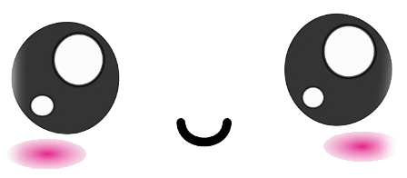
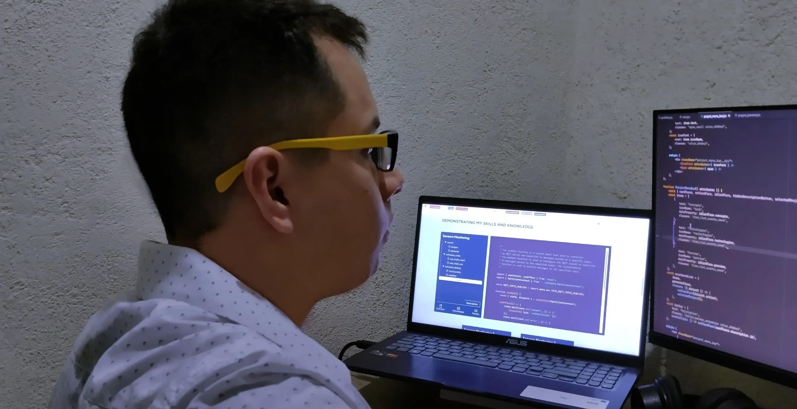

# ¡Hola ✌! 

## Me conocen como "Minimi"!

Con una sólida formación en ingeniería de sistemas computacionales y un constante  
aprendizaje autodidacta, he desarrollado un conjunto de habilidades que me permiten  
abordar y gestionar diversas situaciones y desafíos.

Mi experiencia práctica ha sido esencial para perfeccionar mis  
habilidades en el análisis, planificación, diseño y optimización de sistemas informáticos.

La combinación de mi educación formal y mi aprendizaje autodidacta me ha preparado   
eficazmente para adaptarme y destacar en el dinámico campo de la informática.

<!--  -->
<!--  -->
<!--  -->

## En que me estoy especializando actualmente.
≧◠‿◠≦

## Desarrollando soluciones, Mejorando y adquirindo abilidades

≧◠‿◠≦

Actualmente, estoy trabajando en este proyecto para mejorar mis  
habilidades y mejorar mi portafolio personal.

### Sistema de Gestión de Garantías para Dispositivos Móviles

Durante mi labor en una distribuidora de telefonía identifiqué una oportunidad  
para optimizar la gestión de garantías de dispositivos móviles. Noté que el control  
de los traspasos de garantías entre los participantes de la empresa podrían ser más  
eficientes con un sistema de software.

Este sistema permitiría un seguimiento preciso de los dispositivos en garantía,  
facilitando la asignación de responsabilidades en cuanto a su  
recepción, retención y destino.  
Como resultado, se mejoraría el historial y rastreo de los dispositivos.

Esta solución que podría funcionar como un microservicio dependería del sistema  
principal de la empresa.

### Diseño y planificación del sistema

#### Tecnologías y Conceptos clave para el desarrollo del proyecto

  

#### Diagrama de casos de uso UML

### Momento Actual

A pesar de no tener una relación laboral actual con la empresa, sigo invirtiendo  
tiempo y esfuerzo en el proyecto, persiguiendo objetivos personales  
como el aprendizaje y el desarrollo de nuevas habilidades.

Estoy construyendo un entorno que se asemeja o se inspira en el que se necesitaba  
este software, manteniendo siempre el respeto por la privacidad y sin  
poner en riesgo ninguna información sensible o propiedad de la empresa.

Si bien me gustaría tener la oportunidad de presentar la solución que estoy  
desarrollando a la empresa para la que anteriormente trabajaba, mi principal  
objetivo es evidenciar las habilidades y conocimientos que tengo.

Quiero demostrar mi capacidad para analizar y diseñar soluciones  
efectivas a los desafíos que las organizaciones a las que estoy postulando como  
desarrollador de software puedan enfrentar.

<!-- **************************************************************************************************************** -->

<!-- ### Primera edición HackaCode - TodoCode

Un parque de diversiones necesita de una aplicación web para administrar los datos  
de las entradas vendidas en cada uno de sus juegos.  
[Escenario](https://hackacode.todocodeacademy.com/index.php/escenarios/)

### Diseño y planificación del sistema

#### Tecnologías clave para el proyecto

#### Diagrama de casos de uso UML

Sigo dedicando tiempo y esfuerzo al proyecto y logrando resultados positivos. -->

<!-- **************************************************************************************************************** -->

## Mi historia de crecimiento profesional

≧◠‿◠≦

Estoy capacitado para colaborar en la implementación de la transformación digital de  
productos y servicios. Mi experiencia incluye la automatización de procesos, administración  
de base datos y análisis funcional.

Mi objetivo es disfrutar del proceso mientras alcanzo mis metas y me desarrollo  
como Staff Engineer. Para lograrlo, me enfoco en mejorar continuamente mis habilidades  
emocionales y técnicas, aumentando mi efectividad en liderazgo, planificación, diseño y  
desarrollo. Además, busco transmitir confianza y apoyar en la mentoría al personal de  
ingeniería junior, guiándolos en su crecimiento profesional. Al hacerlo, no solo tengo  
éxito en mi carrera, sino que también enriquezco los aspectos importantes de mi vida personal.

A lo largo de mi educación y ambito profesional he adquirido conocimientos en una amplia  
variedad de herramientas y tecnologías. Estos conocimientos me han brindado la  
capacidad para enfrentar con éxito diversos desafíos y situaciones.

<!-- badge personalizado -->

  

  

 
  

  

  

  

## Explorando mis pasatiempos favoritos

≧◠‿◠≦

Soy un gran fanático del anime y las series coreanas. No solo las disfruto como  
una forma de entretenimiento, sino que también me gusta apreciarlas desde una  
perspectiva más profunda y reflexiva.  
Tambien me gusta jugar al fútbol de manera casual, aunque hace un tiempo que no lo practico.

Actualmente estoy trabajando en retomar mis aficiones como el dibujo, los  
videojuegos, sistemas embebidos y en particular, mi entusiasmo por el simulador de  
baile Pump It Up.

<!--
           __-----_.                        ________
          /  \      \           o  O  O   _(        )__
         /    |  |   \_---_   o._.      _(             )_
        |     |            \   | |""""(_   Hello World!  )
        |     |             |@ | |    (_               _)
         \___/   ___       /   | |      (__          _)
           \____(____\___/     | |         (________)
           |__|                | |          |
           /   \-_             | |         |'
         /      \_ "__ _       !_!--v---v--"
        /         "|  |>)      |""""""""|
       |          _|  | ._--""||        |
       _\_____________|_|_____||________|_
      /                                   \
     /_____________________________________\
     /                                     \
    /_______________________________________\
    /                                       \
   /_________________________________________\
        {                               }
        <_______________________________|
        |                               >
        {_______________________________|               ________
        <                               }              / MINIMI \
        |_______________________________|             /__________\
\|/       \\/             \||//           |//                       \|/    |/

--->
