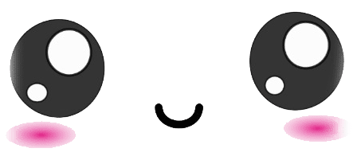
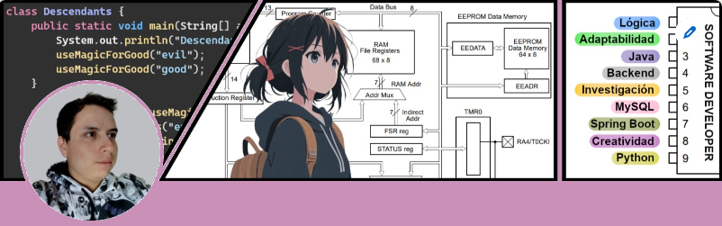

# ¡Hola ✌! 

## Me conocen como "Minimi"

---
Desarrollador de software con más de tres años de experiencia  
Especializado en backend

＼_ﾍ(ω｀●) ~匸P  

## Experiencia Profesional
⠀∧＿∧  
( ´ •̥̥̥ ω •̥̥̥ )　　  ❀  
,, ( ヽ∩∩ ) ,, ヽ|〃 ,,,  
“““ ““ ““ ““ ““ ““ ““ ““ ““  

Tengo más de tres años de experiencia como desarrollador de software, durante  
los cuales he colaborado en soluciones con análisis de requisitos, administración  
de bases de datos, análisis funcional, planificación y diseño.

Por medio de reflexiones personales, he aprendido a valorar mis habilidades  
en adaptabilidad, investigación y creatividad. Estas cualidades me han permitido  
mantener un aprendizaje continuo, asimilar nuevos conceptos así como colaborar  
con soluciones efectivas en diversos contextos.

En mi educación, además de mi dedicación al área de sistemas computacionales  
también tengo un interés particular en la electrónica y los sistemas embebidos.  
Planeo cursar una ingeniería relacionada con esta área.

Una parte fundamental de mi carácter es valorar cada avance y desafío, por más  
sutiles que sean. Utilizo la experiencia adquirida para mejorar continuamente mis  
habilidades técnicas, personales e interpersonales.

## Contacto Profesional
&nbsp;&nbsp;♡∩_∩  
（„• ֊ •„)♡  
┏━∪∪━━━━━━━━━━━┓  

&nbsp;&nbsp;
&nbsp;  

## Especialización
&nbsp;&nbsp;&nbsp;&nbsp;&nbsp;&nbsp;/)＿/)☆  
／(๑^᎑^๑)っ ＼  
|￣∪￣  ￣ |＼／  
|＿＿_＿＿|／  

  

  

## Objetivos Personales
&nbsp;∧ ,, ∧  
(  ̳• · • ̳)  
/&nbsp;&nbsp;&nbsp;&nbsp;づ♡

Dedicar tiempo significativo a mi aprendizaje profesional y desarrollo personal  
con el objetivo final de alcanzar el puesto de ingeniero principal de software.

Deseo ser una fuente de inspiración y un mentor para el equipo de ingenieros  
en formación. Creo que al hacer esto, no solo avanzaré en mi carrera profesional  
sino que también enriqueceré aspectos importantes de mi vida.

## Intereses Recreativos
(づ˶•༝•˶)づ♡

Soy un gran fanático del anime y las series coreanas. No solo las disfruto como  
una forma de entretenimiento, sino que también me gusta apreciarlas desde una  
perspectiva más profunda y reflexiva.

Estoy dedicando tiempo para reanudar las actividades que más me agradan, entre  
las que se encuentran dibujar, los videojuegos de combate competitivos, practicar  
futbol y sobre todo, bailar en el simulador Pump It Up.

## Proyecto Personal
&nbsp;&nbsp;╱|&nbsp;、  
(˚ˎ 。 7  
 &nbsp;|、 ˜〵  
じしˍ ,)ノ

### Microservicio para Gestión de Garantías de Telefonía

Aunque actualmente no tengo una relación laboral con la empresa estoy  
dedicando esfuerzos y tiempo a este proyecto con el fin de mejorar mis  
habilidades y enriquecer mi portafolio personal.

